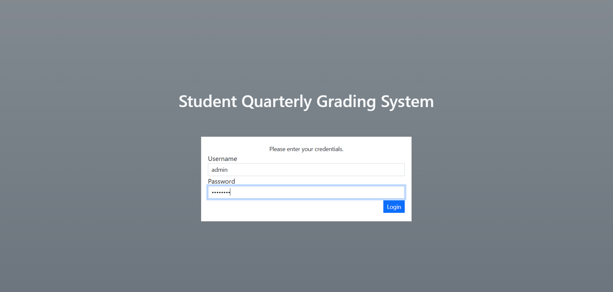
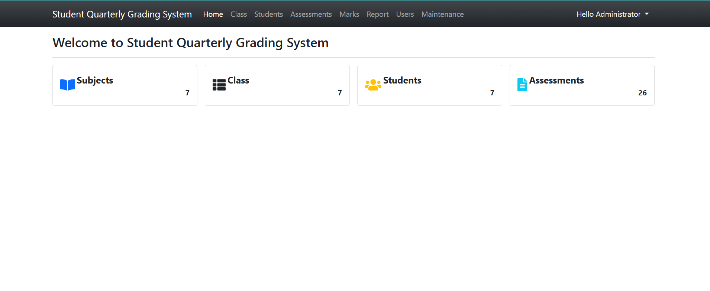
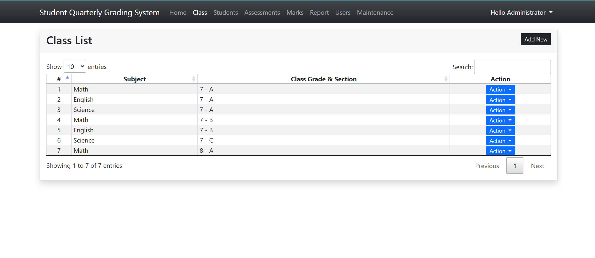
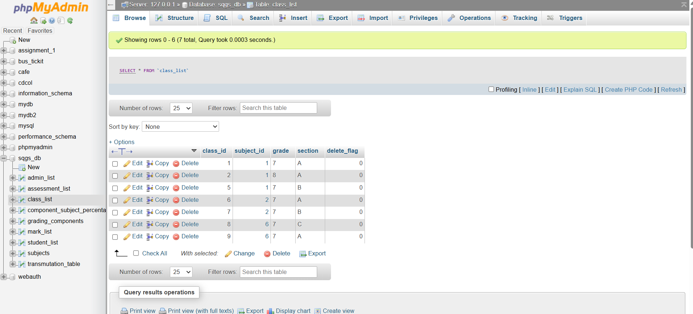

# 🎓 Student Quarterly Grading System

A simple and intuitive **Student Quarterly Grading System** built with **PHP** and **MySQL**, designed to help educators manage and assess student performance efficiently across quarters.
---
## 📚 About This Project

This **Student Quarterly Grading System** is a complete academic grading solution developed with **PHP**, **MySQL**, **HTML**, and **CSS**. Built for simplicity and functionality, the system is ideal for managing student data, subjects, and quarterly assessments in schools or other learning environments. It features secure login, automatic grade computation, and easy-to-navigate interfaces for administrators.

Whether you're an educator looking for an offline grading tool or a developer learning PHP, this project serves as a practical example of real-world PHP & MySQL CRUD operations.

---

🔧 **Technologies Used:**
- PHP 7+
- MySQL / phpMyAdmin
- HTML5, CSS3
- JavaScript (for basic interactions)
- XAMPP (Apache & MySQL Server)

🖥️ **Use Case:**
- Local school or academic institution
- Educational grading automation
- PHP web development learning tool
---
## 🚀 Features

- Admin panel to manage students, grades, and subjects.
- Secure login system.
- Grade computation and report generation.
- Responsive user interface.
- Easy deployment on XAMPP server.

---

## 📹 Live Demo

📽️ **Live Demo:** [Click here to watch the video](https://drive.google.com/file/d/1pOlxm2hlwUpiyGhuOBsh0NlET8waMWQX/view?usp=sharing)

---

## 🛠️ How to Set Up the Project

Follow the steps below to set up the project on your local machine using **XAMPP**:

1. ✅ Download and install [XAMPP](https://www.apachefriends.org/index.html).
2. ✅ Install a code editor (e.g., **Notepad++**, **Sublime Text**, or **VS Code**).
3. 📦 Download the project ZIP or RAR file.
4. 📂 Extract the archive and locate the `sqgs` folder.
5. 🗂️ Paste the `sqgs` folder inside your XAMPP root directory:
    ```
    C:/xampp/htdocs/
    ```
6. 🌐 Open [phpMyAdmin](http://localhost/phpmyadmin).
7. ➕ Create a new database named:
    ```
    sqgs_db
    ```
8. 🔁 Import the SQL file:
    ```
    /sqgs/sql/sqgs_db.sql
    ```
9. ▶️ Run the application:
    ```
    http://localhost/sqgs
    ```

---

## 🔐 Admin Access

📧 Email: admin
🔑 Password: admin123


---
## 🖼️ Interface Preview

Below are some snapshots of the **Student Quarterly Grading System** in action:

### 🔐 Login Page


### 📊 Dashboard


### 📝 Grade Entry Interface


### 📝 Grade Entry Interface


---

## 🗄️ Database Sample View

The database is managed using **phpMyAdmin**. Here's a glimpse of the structure and sample data:



---

## 🤝 Contribution & Support

If you find any bugs or have suggestions for improvement, feel free to:

- 📧 Contact us via the comments.
- ⭐ Star this repository if you found it useful.
- 💬 Leave feedback and share your experience!

---

## 📌 More Projects

Visit our blog for more awesome open-source PHP projects:
👉 [1sourcecodr.blogspot.com](https://1sourcecodr.blogspot.com/)

---

## 🙏 Thank You!

> Thank you for downloading and supporting our work! Your feedback and support keep us motivated.

